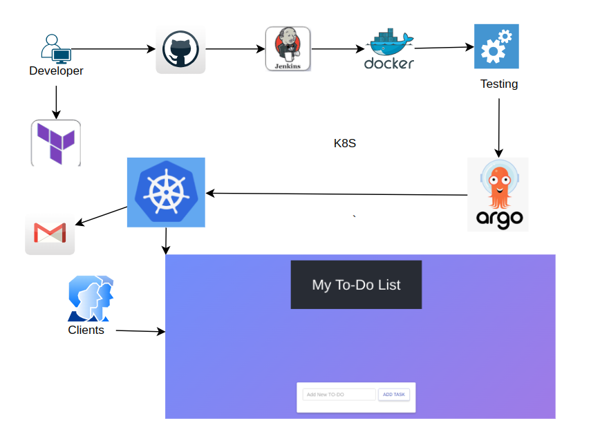
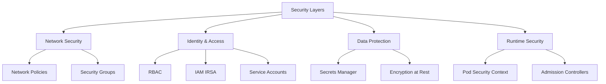

### Deployment Timeline

┌─────────────────────────────────────────────────────────────────┐
│                     # 🚀 Enterprise Todo Application - Cloud-Native Infrastructure

<div align="center">


**A production-grade, highly available, auto-scaling todo application deployed on AWS EKS with complete observability, security, and GitOps automation**

[Features](#-key-features) •
[Architecture](#️-architecture) •
[Quick Start](#-quick-start) •
[Documentation](#-detailed-guide) •
[Monitoring](#-monitoring--observability)

[](https://opensource.org/licenses/MIT)
[](https://www.terraform.io/)
[](https://aws.amazon.com/eks/)

</div>

---

## 📖 Table of Contents

- [Overview](#-overview)
- [Key Features](#-key-features)
- [Architecture](#️-architecture)
- [Technology Stack](#️-technology-stack)
- [Prerequisites](#-prerequisites)
- [Quick Start](#-quick-start)
- [Infrastructure Components](#️-infrastructure-components)
- [Configuration Management](#️-configuration-management)
- [Deployment Strategies](#-deployment-strategies)
- [Monitoring & Observability](#-monitoring--observability)
- [Security Implementation](#-security-implementation)
- [Scaling & Performance](#-scaling--performance)
- [CI/CD Pipeline](#-cicd-pipeline)
- [Cost Optimization](#-cost-optimization)
- [Troubleshooting](#-troubleshooting-guide)
- [Best Practices](#-best-practices)
- [Contributing](#-contributing)

---

## 🎯 Overview



> **Transform your DevOps workflow with enterprise-grade infrastructure**

This project implements a **production-ready, cloud-native todo application** that demonstrates modern DevOps best practices and cloud-native architecture patterns. Built entirely with Infrastructure as Code (IaC), this solution provides a robust foundation for deploying scalable applications on AWS.

### 🎪 What Makes This Special?

<table>
<tr>
<td width="50%">

#### 🔄 **Zero-Downtime Operations**
- Rolling updates with health checks
- Blue-green deployment ready
- Automatic rollback on failures
- Pod disruption budgets

</td>
<td width="50%">

#### 📈 **Auto-Scaling Everything**
- Horizontal Pod Autoscaler (HPA)
- Cluster Autoscaler for nodes

</td>
</tr>
<tr>
<td width="50%">

#### 🛡️ **Security-First Design**
- Network policies enforcement
- AWS Secrets Manager integration
- RBAC & IRSA implementation
- Pod security contexts

</td>
<td width="50%">

#### 📊 **Full Observability**
- Prometheus metrics collection
- Grafana dashboards
- Application & infrastructure monitoring

</td>
</tr>
<tr>
<td width="50%">

#### 🚀 **GitOps Automation**
- ArgoCD for continuous deployment
- Self-healing applications
- Declarative configuration
- Git as single source of truth

</td>
<td width="50%">

#### 💰 **Cost-Optimized**
- Efficient resource allocation
- Auto-scaling based on demand
- Right-sized infrastructure

</td>
</tr>
</table>

---

## 🌟 Key Features

### 🏗️ Infrastructure Features

| Feature | Description | Benefit | Status |
|---------|-------------|---------|--------|
| **Multi-AZ Deployment** | Resources distributed across 2 availability zones | 99.99% uptime SLA | ✅ Active |
| **Auto-Scaling** | HPA for pods + Cluster Autoscaler for nodes | Cost optimization + performance | ✅ Active |
| **Dynamic Storage** | EBS CSI driver with automatic volume provisioning | Zero manual intervention | ✅ Active |
| **Secure Communication** | Network policies + Ingress controller | Secure communication | ✅ Active |
| **Secrets Management** | AWS Secrets Manager + CSI driver | Zero hardcoded credentials | ✅ Active |
| **Load Balancing** | AWS NLB with cross-zone balancing | High availability | ✅ Active |

### 🔄 CI/CD Features

 #### 📦 Continuous Integration (Jenkins)

```yaml
Pipeline Stages:
  1. Checkout → Clone repository
  2. Docker Build → Create container images
  3. Do Smoke Tests
  4. Push → Publish to registry
  5. Deploy → Trigger ArgoCD sync
  6. Send Email Notification
```


 #### 🚀 Continuous Deployment (ArgoCD)

```yaml
GitOps Features:
  - Auto-sync from Git repository
  - Self-healing on drift detection
  - Rollback capability
  - Multi-environment support
  - Progressive delivery (canary ready)
  - Sync waves for ordered deployment
  - Health assessment
  - Resource pruning

Applications Managed:
  1. todo-app-db → Database layer
  2. todo-app-backend → API services
  3. todo-app-front → Frontend application
  4. todo-app-jenkins → PV and PVC for Jenkins
```


### 🔒 Security Features



### 🔐 Security Implementation Details

#### Network Security
- ✅ **Network Policies**: Namespace isolation with explicit allow rules
- ✅ **Security Groups**: AWS-level traffic filtering
- ✅ **Private Networking**: Internal service communication

#### Identity & Access Management
- ✅ **RBAC**: Fine-grained Kubernetes permissions
- ✅ **IAM IRSA**: Pod-level AWS permissions via OIDC
- ✅ **Service Accounts**: Dedicated accounts per workload
- ✅ **Least Privilege**: Minimal permissions principle

#### Data Protection
- ✅ **AWS Secrets Manager**: Centralized secret storage
- ✅ **CSI Secrets Driver**: Secure secret mounting
- ✅ **EBS Encryption**: Volume-level encryption
- ✅ **KMS Integration**: Key management service

#### Runtime Security
- ✅ **Security Contexts**: Non-root containers
- ✅ **Read-only Filesystems**: Immutable containers
- ✅ **Resource Limits**: DoS prevention
- ✅ **Pod Security Standards**: Restricted policies


---

## 🏛️ Architecture

### System Architecture Diagram

```
┌─────────────────────────────────────────────────────────────────────────────┐
│                           AWS Cloud (us-east-1)                              │
│                                                                               │
│  ┌─────────────────────────────────────────────────────────────────────┐   │
│  │                     Internet Gateway                                  │   │
│  └──────────────────────────────┬───────────────────────────────────────┘   │
│                                  │                                            │
│  ┌──────────────────────────────▼───────────────────────────────────────┐   │
│  │              Network Load Balancer (NLB)                              │   │
│  │              • Internet-facing                                        │   │
│  │              • Cross-zone load balancing                             │   │
│  │              • Health checks enabled                                  │   │
│  └──────────────────────────────┬───────────────────────────────────────┘   │
│                                  │                                            │
│  ┌───────────────────────────────────────────────────────────────────────┐  │
│  │                    VPC: 10.0.0.0/16                                    │  │
│  │                                                                         │  │
│  │  ┌─────────────────────┐              ┌─────────────────────┐        │  │
│  │  │   Public Subnet 1   │              │   Public Subnet 2   │        │  │
│  │  │    10.0.0.0/24      │              │    10.0.1.0/24      │        │  │
│  │  │   (us-east-1a)      │              │   (us-east-1b)      │        │  │
│  │  └─────────────────────┘              └─────────────────────┘        │  │
│  │                                                                         │  │
│  │  ┌─────────────────────────────────────────────────────────────────┐  │  │
│  │  │              EKS Cluster: todo-app-cluster                       │  │  │
│  │  │              • Kubernetes v1.28+                                 │  │  │
│  │  │              • OIDC Provider Enabled                            │  │  │
│  │  │              • IRSA for Pod-level IAM                           │  │  │
│  │  │                                                                   │  │  │
│  │  │  ┏━━━━━━━━━━━━━━━━━━━━━━━━━━━━━━━━━━━━━━━━━━━━━━━━━━━━━━━━┓  │  │  │
│  │  │  ┃              Application Layer                           ┃  │  │  │
│  │  │  ┃                                                            ┃  │  │  │
│  │  │  ┃  ┌─────────────────┐  ┌─────────────────┐               ┃  │  │  │
│  │  │  ┃  │  Frontend NS    │  │   Backend NS    │               ┃  │  │  │
│  │  │  ┃  │  front-ns       │  │   back-ns       │               ┃  │  │  │
│  │  │  ┃  │                 │  │                 │               ┃  │  │  │
│  │  │  ┃  │  ┌───────────┐  │  │  ┌───────────┐  │               ┃  │  │  │
│  │  │  ┃  │  │   NGINX   │  │  │  │  Node.js  │  │               ┃  │  │  │
│  │  │  ┃  │  │  Proxy    │◄─┼──┼─►│    API    │  │               ┃  │  │  │
│  │  │  ┃  │  └─────┬─────┘  │  │  └─────┬─────┘  │               ┃  │  │  │
│  │  │  ┃  │  ┌─────▼─────┐  │  │        │        │               ┃  │  │  │
│  │  │  ┃  │  │   React   │  │  │        │        │               ┃  │  │  │
│  │  │  ┃  │  │    SPA    │  │  │        │        │               ┃  │  │  │
│  │  │  ┃  │  └───────────┘  │  │        │        │               ┃  │  │  │
│  │  │  ┃  │                 │  │        │        │               ┃  │  │  │
│  │  │  ┃  │  • Replicas: 3  │  │  • Replicas: 3-10               ┃  │  │  │
│  │  │  ┃  │  • HPA: ✗       │  │  • HPA: ✓ (75% CPU)             ┃  │  │  │
│  │  │  ┃  │  • Anti-affinity│  │  • Anti-affinity                ┃  │  │  │
│  │  │  ┃  │  • Resources:   │  │  • Resources:                   ┃  │  │  │
│  │  │  ┃  │    CPU: 0.5-1   │  │    CPU: 0.5-1                   ┃  │  │  │
│  │  │  ┃  │    Mem: 200Mi-1G│  │    Mem: 200Mi-1G                ┃  │  │  │
│  │  │  ┃  └────────┬────────┘  └────────┬────────┘               ┃  │  │  │
│  │  │  ┃           │                     │                       ┃  │  │  │
│  │  │  ┃           └─────────┬───────────┘                       ┃  │  │  │
│  │  │  ┃                     │                                   ┃  │  │  │
│  │  │  ┃            ┌────────▼────────┐                          ┃  │  │  │
│  │  │  ┃            │   Database NS    │                          ┃  │  │  │
│  │  │  ┃            │     db-ns        │                          ┃  │  │  │
│  │  │  ┃            │                  │                          ┃  │  │  │
│  │  │  ┃            │  ┌────────────┐  │                          ┃  │  │  │
│  │  │  ┃            │  │  MongoDB   │  │                          ┃  │  │  │
│  │  │  ┃            │  │ StatefulSet│  │                          ┃  │  │  │
│  │  │  ┃            │  └──────┬─────┘  │                          ┃  │  │  │
│  │  │  ┃            │         │        │                          ┃  │  │  │
│  │  │  ┃            │  ┌──────▼─────┐  │                          ┃  │  │  │
│  │  │  ┃            │  │ EBS Volume │  │                          ┃  │  │  │
│  │  │  ┃            │  │   10Gi     │  │                          ┃  │  │  │
│  │  │  ┃            │  │   gp3      │  │                          ┃  │  │  │
│  │  │  ┃            │  └────────────┘  │                          ┃  │  │  │
│  │  │  ┃            │                  │                          ┃  │  │  │
│  │  │  ┃            │  • Replicas: 1   │                          ┃  │  │  │
│  │  │  ┃            │  • Persistent    │                          ┃  │  │  │
│  │  │  ┃            │  • Headless Svc  │                          ┃  │  │  │
│  │  │  ┃            └──────────────────┘                          ┃  │  │  │
│  │  │  ┗━━━━━━━━━━━━━━━━━━━━━━━━━━━━━━━━━━━━━━━━━━━━━━━━━━━━━━━━┛  │  │  │
│  │  │                                                                   │  │  │
│  │  │  ┏━━━━━━━━━━━━━━━━━━━━━━━━━━━━━━━━━━━━━━━━━━━━━━━━━━━━━━━━┓  │  │  │
│  │  │  ┃              Platform Services Layer                     ┃  │  │  │
│  │  │  ┃              (kube-system, monitoring, jenkins, argocd)  ┃  │  │  │
│  │  │  ┃                                                            ┃  │  │  │
│  │  │  ┃  ┌──────────┐  ┌──────────┐  ┌──────────┐  ┌──────────┐┃  │  │  │
│  │  │  ┃  │ Jenkins  │  │ ArgoCD   │  │Prometheus│  │ Metrics  │┃  │  │  │
│  │  │  ┃  │   CI     │  │  GitOps  │  │  Stack   │  │  Server  │┃  │  │  │
│  │  │  ┃  │          │  │          │  │          │  │          │┃  │  │  │
│  │  │  ┃  │ Port:8080│  │Port:8080 │  │Port:9090 │  │Port:10250│┃  │  │  │
│  │  │  ┃  └──────────┘  └──────────┘  └──────────┘  └──────────┘┃  │  │  │
│  │  │  ┃                                                            ┃  │  │  │
│  │  │  ┃  ┌──────────┐  ┌──────────┐  ┌──────────┐  ┌──────────┐┃  │  │  │
│  │  │  ┃  │ Ingress  │  │EBS CSI   │  │ Cluster  │  │External  │┃  │  │  │
│  │  │  ┃  │  NGINX   │  │ Driver   │  │Autoscaler│  │   DNS    │┃  │  │  │
│  │  │  ┃  │          │  │          │  │          │  │          │┃  │  │  │
│  │  │  ┃  │v4.8.3    │  │v2.26.0   │  │v9.29.3   │  │v1.14.0   │┃  │  │  │
│  │  │  ┃  └──────────┘  └──────────┘  └──────────┘  └──────────┘┃  │  │  │
│  │  │  ┗━━━━━━━━━━━━━━━━━━━━━━━━━━━━━━━━━━━━━━━━━━━━━━━━━━━━━━━━┛  │  │  │
│  │  │                                                                   │  │  │
│  │  │  ┏━━━━━━━━━━━━━━━━━━━━━━━━━━━━━━━━━━━━━━━━━━━━━━━━━━━━━━━━┓  │  │  │
│  │  │  ┃              Compute Layer (EKS Node Group)              ┃  │  │  │
│  │  │  ┃                                                            ┃  │  │  │
│  │  │  ┃  • Instance Type: c7i-flex.large                          ┃  │  │  │
│  │  │  ┃  • Scaling: Min 1, Max 3, Desired 2                      ┃  │  │  │
│  │  │  ┃  • Launch Template with UserData                         ┃  │  │  │
│  │  │  ┃  • EBS Optimized: Yes                                    ┃  │  │  │
│  │  │  ┃  • IAM Role: todo_iam_role                               ┃  │  │  │
│  │  │  ┗━━━━━━━━━━━━━━━━━━━━━━━━━━━━━━━━━━━━━━━━━━━━━━━━━━━━━━━━┛  │  │  │
│  │  └─────────────────────────────────────────────────────────────────┘  │  │
│  └─────────────────────────────────────────────────────────────────────────┘  │
│                                                                               │
│  ┌─────────────────────────────────────────────────────────────────────┐    │
│  │                    AWS Managed Services                              │    │
│  │                                                                       │    │
│  │  ┌──────────────┐  ┌──────────────┐  ┌──────────────┐             │    │
│  │  │   Secrets    │  │      S3      │  │     EBS      │             │    │
│  │  │   Manager    │  │  Config      │  │  Volumes     │             │    │
│  │  │              │  │  Storage     │  │  gp3 Type    │             │    │
│  │  └──────────────┘  └──────────────┘  └──────────────┘             │    │
│  │                                                                       │    │
│  │  ┌──────────────┐  ┌──────────────┐  ┌──────────────┐             │    │
│  │  │     IAM      │  │     KMS      │  │   Route53    │             │    │
│  │  │   Roles      │  │ Encryption   │  │     DNS      │             │    │
│  │  │   & IRSA     │  │    Keys      │  │  Management  │             │    │
│  │  └──────────────┘  └──────────────┘  └──────────────┘             │    │
│  └─────────────────────────────────────────────────────────────────────┘    │
└─────────────────────────────────────────────────────────────────────────────┘
```

### Network Architecture

```
┌─────────────────────────────────────────────────────────────────────┐
│                     VPC: 10.0.0.0/16                                 │
│                     • DNS Hostname: Enabled                          │
│                     • DNS Resolution: Enabled                        │
│                                                                      │
├─────────────────────────────────────────────────────────────────────-┤
│                                                                       │
│  ┌──────────────────────────┐    ┌──────────────────────────┐      │
│  │  Availability Zone A     │    │  Availability Zone B     │      │
│  │  (us-east-1a)            │    │  (us-east-1b)            │      │
│  ├──────────────────────────┤    ├──────────────────────────┤      │
│  │ Public Subnet            │    │ Public Subnet            │      │
│  │ 10.0.0.0/24              │    │ 10.0.1.0/24              │      │
│  │ Available IPs: 251       │    │ Available IPs: 251       │      │
│  │                          │    │                          │      │
│  │ ┌────────────────────┐   │    │ ┌────────────────────┐   │      │
│  │ │ EKS Worker Node 1  │   │    │ │ EKS Worker Node 2  │   │      │
│  │ │ ────────────────── │   │    │ │ ────────────────── │   │      │
│  │ │ c7i-flex.large     │   │    │ │ c7i-flex.large     │   │      │
│  │ │ 2 vCPUs, 4GB RAM   │   │    │ │ 2 vCPUs, 4GB RAM   │   │      │
│  │ │                    │   │    │ │                    │   │      │
│  │ │ Running Pods:      │   │    │ │ Running Pods:      │   │      │
│  │ │ • Frontend: 1-2    │   │    │ │ • Frontend: 1-2    │   │      │
│  │ │ • Backend: 1-5     │   │    │ │ • Backend: 1-5     │   │      │
│  │ │ • Database: 0-1    │   │    │ │ • Database: 0      │   │      │
│  │ │ • System: 8-12     │   │    │ │ • System: 8-12     │   │      │
│  │ └────────────────────┘   │    │ └────────────────────┘   │      │
│  │                          │    │                          │      │
│  │ Route Table:             │    │ Route Table:             │      │
│  │ ┌────────────────────┐   │    │ ┌────────────────────┐   │      │
│  │ │ 0.0.0.0/0 → IGW    │   │    │ │ 0.0.0.0/0 → IGW    │   │      │
│  │ │ 10.0.0.0/16 → Local│   │    │ │ 10.0.0.0/16 → Local│   │      │
│  │ └────────────────────┘   │    │ └────────────────────┘   │      │
│  │                          │    │                          │      │
│  │ Tags:                    │    │ Tags:                    │      │
│  │ kubernetes.io/role/elb=1 │    │ kubernetes.io/role/elb=1 │      │
│  │ kubernetes.io/cluster/   │    │ kubernetes.io/cluster/   │      │
│  │   todo-app-cluster=shared│    │   todo-app-cluster=shared│      │
│  └──────────────────────────┘    └──────────────────────────┘      │
│                                                                       │
│  ┌─────────────────────────────────────────────────────────────┐   │
│  │              Internet Gateway                                │   │
│  │              • Attached to VPC                               │   │
│  │              • Enables internet access                       │   │
│  └─────────────────────────────────────────────────────────────┘   │
└─────────────────────────────────────────────────────────────────────┘

Network Policies in Effect:
┌─────────────────────────────────────────────────────────────────────┐
│ Namespace Isolation:                                                 │
│ ┌─────────────┐     Port 8080      ┌─────────────┐                 │
│ │  front-ns   │ ─────────────────> │   back-ns   │                 │
│ │  (allowed)  │                     │  (allowed)  │                 │
│ └─────────────┘                     └──────┬──────┘                 │
│                                             │                         │
│                                    Port 27017                        │
│                                             │                         │
│                                     ┌───────▼──────┐                 │
│                                     │    db-ns     │                 │
│                                     │  (allowed)   │                 │
│                                     └──────────────┘                 │
│                                                                       │
│ External Access:                                                     │
│ ┌─────────────┐                                                      │
│ │  Internet   │ ──────> NLB ──────> Ingress ──────> front-ns       │
│ └─────────────┘         (8080)      (8080)          (8080)          │
│                                                                       │
│ All other traffic: DENIED by default                                │
└─────────────────────────────────────────────────────────────────────┘
```

### What Gets Deployed?

  #### AWS Resources (54 resources)

  **Network (8 resources)**
  - 1 VPC (10.0.0.0/16)
  - 2 Public Subnets (Multi-AZ)
  - 1 Internet Gateway
  - 1 Route Table
  - 2 Route Table Associations
  - 1 Network Load Balancer

  **Compute (12 resources)**
  - 1 EKS Cluster
  - 1 EKS Node Group
  - 1 Launch Template
  - 2-3 EC2 Instances (c7i-flex.large)
  - 1 Auto Scaling Group
  - 1 OIDC Provider

  **Storage (3 resources)**
  - 1 S3 Bucket (nginx config)
  - 3+ EBS Volumes (10Gi each, gp3)
  - Storage Class (ebs-sc)

  **Security (15 resources)**
  - 7 IAM Roles
  - 7 IAM Policies
  - 7 IAM Role Policy Attachments
  - 1 AWS Secrets Manager Secret
  - 1 KMS Key

  **Networking (3 resources)**
  - Multiple Security Groups
  - Route53 Records (if using External DNS)
  - VPC Endpoints (optional)

  #### Kubernetes Resources (80+ resources)

  **Namespaces (6)**
  - front-ns (Frontend)
  - back-ns (Backend)
  - db-ns (Database)
  - jenkins (CI)
  - argocd (CD)
  - monitoring (Observability)

  **Workloads (15+ pods typically)**
  - Frontend: 3 pods
  - Backend: 3-10 pods (HPA)
  - Database: 1 pod (StatefulSet)
  - Jenkins: 1 pod
  - ArgoCD: 3 pods
  - Prometheus: 2 pods
  - Grafana: 1 pod
  - System pods: 10-15 pods

  **Services (12)**
  - front-service (ClusterIP)
  - back-service (ClusterIP)
  - mongodb-service (Headless)
  - jenkins (ClusterIP)
  - argocd-server (LoadBalancer)
  - ingress-nginx-controller (LoadBalancer)
  - prometheus-server (ClusterIP)
  - grafana (ClusterIP)
  - And more...

  **Storage (4)**
  - jenkins-pv/pvc (10Gi)
  - mongodb-pvc (10Gi per replica)
  - prometheus-pvc (if enabled)

  **Config & Secrets (10)**
  - back-config-map
  - db-secret
  - back-secret
  - jenkins-config
  - argocd-cm
  - prometheus-config
  - And more...

  **RBAC (20+ resources)**
  - Service Accounts
  - Roles
  - ClusterRoles
  - RoleBindings
  - ClusterRoleBindings

  **CRDs & Operators (5 Helm releases)**
  - NGINX Ingress Controller
  - EBS CSI Driver
  - Metrics Server
  - Cluster Autoscaler
  - Secrets Store CSI Driver

  **Monitoring Stack (30+ resources)**
  - Prometheus Operator
  - ServiceMonitors
  - PodMonitors
  - AlertManager
  - Grafana
  - Node Exporter
  - kube-state-metrics
